# 职业武器
这里写了所有职业武器的合成表
注意：只有符合职业的武器才能获得buff和技能！制作其他武器只能当摆设！

## 拳套术士：拳套
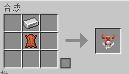
## 萨满：萨满权杖
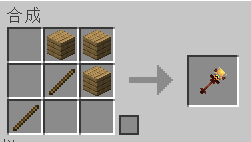

## 德鲁伊：自然法杖
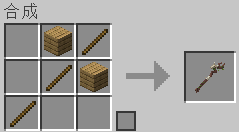

## 圣骑士：神圣之锤
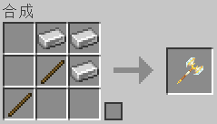

## 忍者：忍者长刀
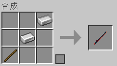

## 战士：战士长剑
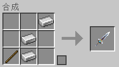

## 死灵法师：死灵法师权杖
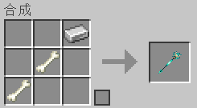

## 吟游诗人：吟游诗人竖琴
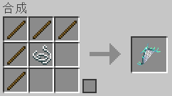

## 法师：法师权杖
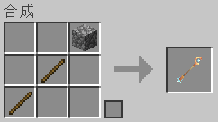

## 龙战士：战龙双戟
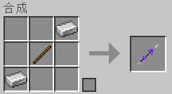

## 枪手：枪手短枪
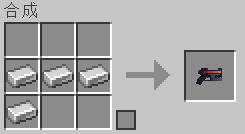

## 弓箭手：弓箭手长弓
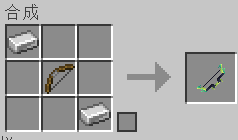

## 大法师：大法师权杖

## 牧师：牧师权杖
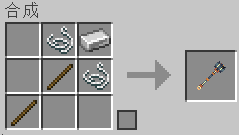

## 刺客：刺客短剑
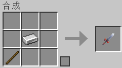